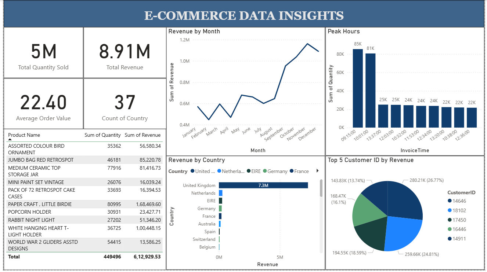

# TAMIZHAN_SKILLS

This repository contains three major data analytics and machine learning projects completed during my internship with **Tamizhan Skills**.  
Each project focuses on solving real-world business problems using data-driven insights, predictive modeling, and clustering techniques.

---

## 📂 Projects Overview

### 1. E-COMMERCE SALES INSIGHTS
- **Objective:** Analyze e-commerce sales data to extract insights such as revenue trends, customer distribution, peak sales hours, and top-selling products.
- **Tech Stack:** Python, Power BI / Excel, Data Visualization
- **Key Highlights:**
  - Total Revenue and Quantity sold
  - Revenue by Month & Country
  - Peak Sales Hours
  - Top Customers & Products
- **Output Screenshot:**  
  

---

### 2. SALES FORECASTING
- **Objective:** Predict future sales using machine learning (Linear Regression).
- **Tech Stack:** Python (Pandas, Matplotlib, Scikit-learn), CSV Data
- **Key Highlights:**
  - Data preprocessing and trend analysis
  - Built a linear regression model
  - Compared Actual vs Predicted sales
- **Output Screenshot:**  
  

---

### 3. CUSTOMER SEGMENTATION (K-Means Clustering)
- **Objective:** Segment customers into different groups based on their behavior (spending score, income, etc.) using K-Means Clustering.
- **Tech Stack:** Python (Pandas, Matplotlib, Scikit-learn)
- **Key Highlights:**
  - Applied K-Means clustering on mall customer dataset
  - Identified meaningful customer groups
  - Visualized clusters for better business insights
- **Output Screenshot:**  
  

---

## 🚀 Tools & Platforms Used
- Python (Pandas, NumPy, Matplotlib, Scikit-learn)
- Power BI / Excel (for visualization dashboards)
- GitHub for version control

---

## 📖 Takeaways
- Gained hands-on experience with **data analysis, forecasting, and clustering** techniques.  
- Learned to **visualize insights** effectively for business decision-making.  
- Strengthened knowledge of **machine learning and business intelligence** applications.

