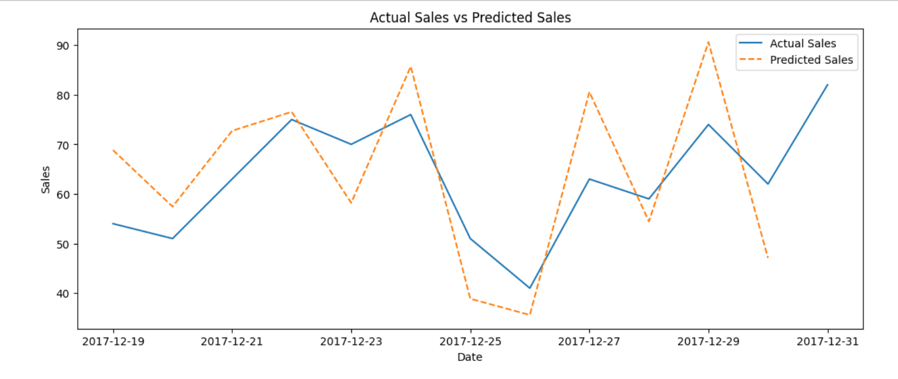

# SALES FORECASTING

## 📌 Objective
Build a **sales forecasting model** using linear regression to predict future sales trends.

## 📊 Project Details
- Collected and cleaned monthly sales data
- Performed **trend analysis**
- Applied **Linear Regression model**
- Compared **Actual Sales vs Predicted Sales**

## 🛠️ Tech Used
- Python (Pandas, NumPy, Matplotlib, Scikit-learn)
- Dataset: monthly_sales.csv

## 📷 Output

