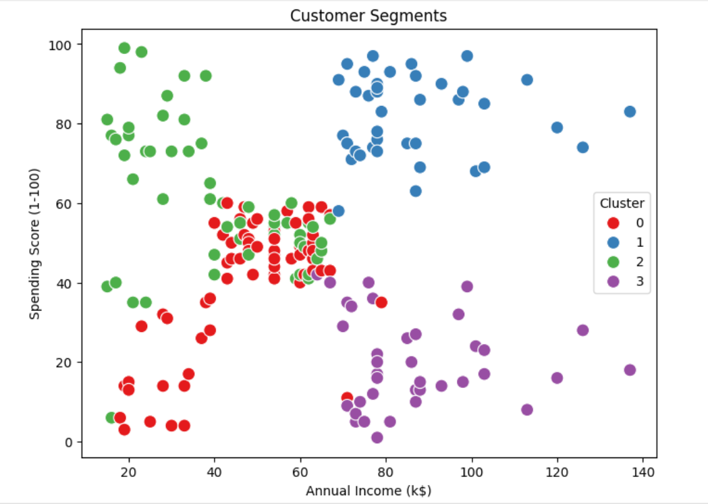
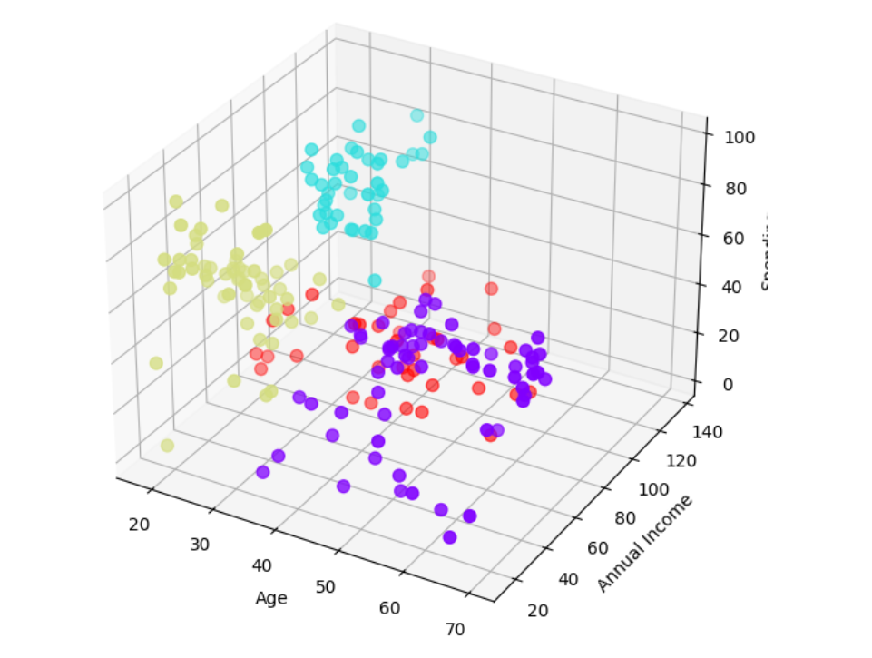

# CUSTOMER SEGMENTATION (K-Means Clustering)

## 📌 Objective
Cluster customers into groups based on their **spending score** and other features for targeted marketing strategies.

## 📊 Project Details
- Used **Mall Customers Dataset**
- Applied **K-Means Clustering**
- Identified **4 customer segments** with distinct patterns
- Visualized clusters using scatter plots

## 🛠️ Tech Used
- Python (Pandas, NumPy, Matplotlib, Scikit-learn)
- Dataset: Mall_Customers.csv

## 📷 Output

